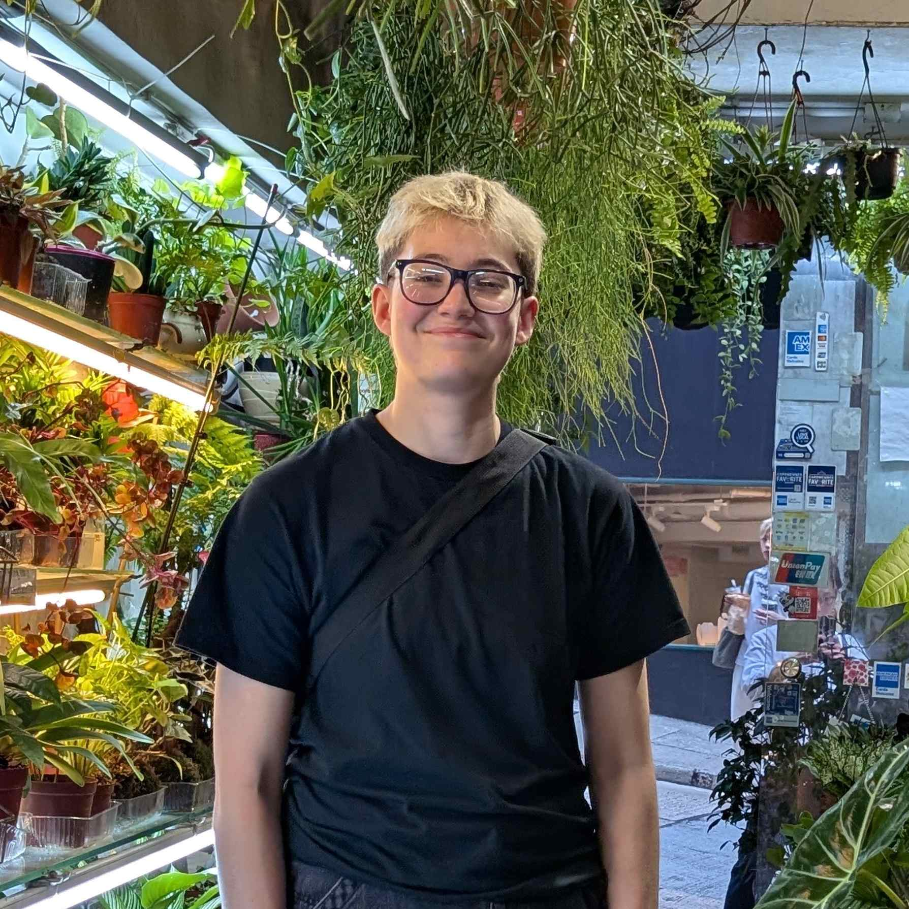

  
  

    <h1 class="title">Hi I'm Thomas!</h1>
    

  <a href="https://scholar.google.com/citations?user=OVXyJ5MAAAAJ&hl=en" target="_blank" rel="noopener" style="display:inline-flex;align-items:center;gap:0.5rem;text-decoration:none;color:var(--color-accent-2);">
    <svg viewBox="0 0 24 24" role="img" aria-hidden="true" style="width:20px;height:20px;opacity:0.9;" xmlns="http://www.w3.org/2000/svg" fill="currentColor">
      <path d="M12 24a7 7 0 1 1 0-14 7 7 0 0 1 0 14zm0-24L0 9.5l4.838 3.94A8 8 0 0 1 12 9a8 8 0 0 1 7.162 4.44L24 9.5z"/>
    </svg>

We're working on a PogoStuck clone that users can make world edits and make the world larger, making the game harder over time!
